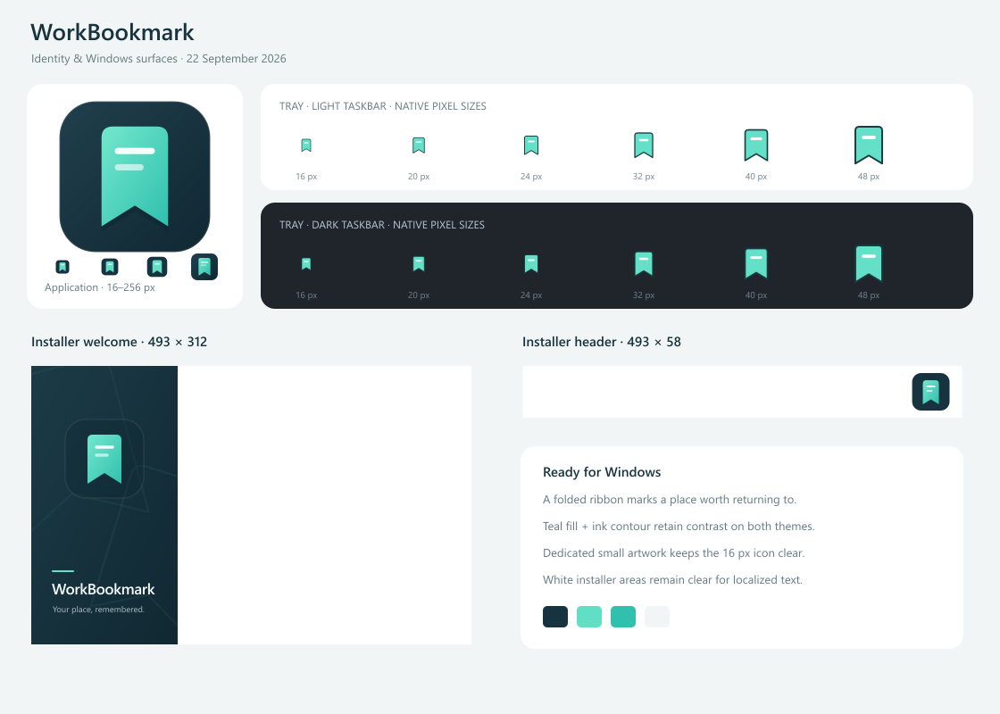

# 업무 책갈피 / WorkBookmark

Windows 탐색기·Excel·Word·PowerPoint·메모장의 작업 위치와 Edge·Chrome 웹페이지를 로컬에 남기는 트레이 도구입니다.

**[설치 및 사용 매뉴얼](docs/user-manual.ko.md)** — MSI·포터블 설치, 프로그램별 사용법, 설정, 백업·복원, 업데이트·제거와 문제 해결을 안내합니다. 처음 실행해 보려면 [빠른 시작](docs/quick-start.ko.md)을 참고하세요.

**[WorkBookmark 0.2.2 다운로드](https://github.com/prozac0401/BookMark/releases/tag/v0.2.2)** — 설정에서 목록과 포스트잇 스티커 중 표시 방식을 선택할 수 있습니다. 스티커의 위치·크기를 조절하고, 지운 책갈피는 최근 삭제에서 복원할 수 있습니다. [변경 사항과 업데이트 안내](docs/release-notes-v0.2.2.md) · [MSI 설치 안내](docs/windows-installer.ko.md).

**0.2.2**에서는 스티커의 **메모 텍스트 영역을 한 번 클릭**하면 바로 그 자리에서 편집합니다. 메모가 비어 있으면 안내 문구가 있는 영역을 누르세요. Release 빌드와 Desktop 회귀검사 197개를 통과했습니다. [검증 결과와 화면](docs/evidence/note-click-2026-09-22/README.md)을 확인하세요. 항상 위 표시, 해당 스티커만 처리 표시, 파일 종류 아이콘은 [0.2.1에서 추가한 기능](docs/sticker-fixes-v0.2.1.ko.md)입니다.

설치 패키지는 **서명되지 않았습니다**. 실제 설치·업데이트·재부팅, 마우스 입력·한글 IME·여러 모니터 실기는 미실행입니다. [이번 릴리스의 확인 범위](docs/release-notes-v0.2.2.md)를 참고하세요.



Windows 빌드·자동검사와 실제 환경별 확인 결과는 [검증 보고서](docs/validation-report.md)와 [호환성표](docs/compatibility.md)에 정리했습니다.

- Ctrl+Alt+B: 탐색기 폴더/단일 선택 항목, Excel 셀, Word 본문 위치, PowerPoint 슬라이드 기록
- 메모장: 새 문서·미저장 내용에서 Ctrl+Alt+B로 본문과 선택 위치 자동 보관. 재개 시 저장 당시 내용의 별도 복원본을 엽니다.
- Edge·Chrome: 확장 없이 Ctrl+Alt+B로 현재 페이지의 제목·URL 저장. 주소 확인이 제한된 화면은 트레이의 ‘웹페이지 URL로 추가…’ 사용. 기존 [브라우저 확장](browser-extension/README.md)은 선택 사항입니다.
- Ctrl+Alt+J: 설정에서 선택한 목록 또는 스티커 표시. 목록은 Enter, 스티커는 ‘이어가기’로 저장 위치 재개
- 포스트잇 스티커: 이동·크기 조절, 접기, 항상 위 표시, 배치 기억. 기본 표시는 기존 목록 유지
- 선택 메모, 검색, 삭제/10초 연속 되돌리기, 최근 삭제 복원, 접근 실패 항목의 경로 재지정
- 사용자별 로컬 SQLite, 요청마다 별도 STA worker, 외부 전송 없음

[후속 구현 진행·결정 기록](docs/implementation-progress.md) · [한국어 사용 안내](docs/quick-start.ko.md) · [P0 검증](docs/feasibility-report.md) · [구현 결정](docs/decisions.md)

## 실행

`WorkBookmark-0.2.2-win-x64.msi`를 실행하면 이전 MSI 설치를 자동 제거하고 현재 사용자에게 새 버전을 설치합니다. 책갈피와 설정은 유지됩니다. 설치 완료 화면의 **업무 책갈피 실행**은 기본 선택되어 있으며, 바로 실행하지 않으려면 선택을 해제한 뒤 마칩니다. 시작 메뉴에서도 실행할 수 있습니다. Windows 로그인 시 자동 실행은 설정에서 끌 수 있습니다. 제어판 ‘프로그램 제거’ 또는 Windows ‘설치된 앱’에서 제거할 수 있으며 책갈피 데이터는 유지됩니다. 관리자 권한과 SDK 설치는 필요하지 않습니다.

포터블 사용은 self-contained win-x64 ZIP을 **폴더 전체**로 압축 해제하고 `WorkBookmark.exe`를 실행합니다. 트레이 메뉴에서 종료할 수 있습니다.

포스트잇을 쓰려면 **트레이 → 설정 → 포스트잇 스티커로 보기 → 적용**을 선택하세요. 위쪽을 끌어 이동하고 가장자리를 끌어 크기를 바꿉니다. **지우기**는 같은 책갈피를 목록에서도 지우며, **× / Esc**는 스티커만 잠시 숨깁니다. 다시 보려면 **Ctrl+Alt+J**, 검색하려면 **트레이 → 목록에서 찾기**를 사용하세요.

스티커 모드로 실행하면 단축키를 누르기 전부터 스티커가 다른 일반 창 위에 나타납니다. 고정·해제 버튼은 없으며, **메모 텍스트 영역을 한 번 클릭**하면 그 스티커 안에 입력칸이 열립니다. 메모가 없어도 같은 영역을 누르면 됩니다. **Ctrl+E**로도 편집을 시작할 수 있습니다. **저장 / Enter**로 저장하고 **취소 / Esc**로 편집을 취소합니다. 편집 중에는 밖을 클릭해도 자동 저장하지 않습니다. 자세한 사용법은 [사용 매뉴얼](docs/user-manual.ko.md)을 참고하세요.

0.2.0은 데이터 형식을 v5로 갱신하고 변경 전 `.bak` 백업을 남깁니다. **0.1.7은 갱신된 DB를 읽을 수 없습니다.** 구버전 복귀에는 업그레이드 전 백업 복원이 필요합니다. [백업·업데이트 안내](docs/user-manual.ko.md#maintenance)를 확인하세요.

0.2.2도 DB v5를 사용하며, 0.2.0·0.2.1에서 업데이트할 때 새 스키마 이전을 추가하지 않습니다.

## 소스에서 빌드

Windows x64와 .NET SDK **10.0.401**이 필요합니다. 브라우저 확장 자동시험에는 Node.js가 필요하며, PATH에 없으면 build.ps1의 -NodePath로 실행 파일을 지정합니다. 설치되어 있지 않으면 `scripts/bootstrap-sdk.ps1`이 저장소의 `.tools/dotnet`에 공식 ZIP을 내려받고 SHA-512 확인 후 압축 해제합니다. 시스템 SDK를 바꾸지 않습니다.

```powershell
.\scripts\bootstrap-sdk.ps1
.\scripts\build.ps1 -Package -Msi
```

직접 실행 시:

```powershell
$dotnet = ".\.tools\dotnet\dotnet.exe"
& $dotnet restore WorkBookmark.sln --locked-mode --configfile NuGet.Config
& $dotnet build WorkBookmark.sln -c Release --no-restore
& $dotnet run --project tests/WorkBookmark.Core.Tests -c Release --no-build
& $dotnet run --project tests/WorkBookmark.Integration.Tests -c Release --no-build
& $dotnet publish src/WorkBookmark.App -c Release -r win-x64 --self-contained true --no-restore -o artifacts/publish/win-x64
```

배포 MSI·ZIP·Source.zip·검증 JSON·SHA256SUMS.txt는 `artifacts/releases/<빌드시각>/`에 생성됩니다. MSI만 만들 때는 `scripts/build.ps1 -Msi`를 사용합니다. 기본 `Commit` 모드는 깨끗한 작업 트리의 Git HEAD로 Source.zip을 만듭니다. 아직 커밋하지 않은 수정까지 함께 배포하려면 `scripts/build.ps1 -Package -Msi -SourceMode WorkingTree`를 사용합니다. `SourceSnapshot.json`에 기준 커밋과 소스 모드를 기록합니다. 런타임/패키지는 lock 파일로 고정합니다. 자동시험은 Office 실기시험을 대신하지 않습니다.

## 구조

`Core`: DTO·경로 정책·IPC / `Storage`: SQLite / `Windows`: Shell·Office·실험 PDF / `App`: WinForms UI·수명 관리. `tools/Probes`와 `tools/WindowsChecks`는 합성 자료로 P0를 재현하는 개발용 도구이며 실행 ZIP에 포함하지 않습니다.

[확장 요구명세](docs/extension-requirements.md)와 [확장 검증 결과](docs/extension-validation.md)에 변경 범위와 근거를 기록했습니다. [GitHub 릴리스](https://github.com/prozac0401/BookMark/releases)에서 MSI·포터블 ZIP·소스·검증 파일과 이전 버전을 받을 수 있습니다.
