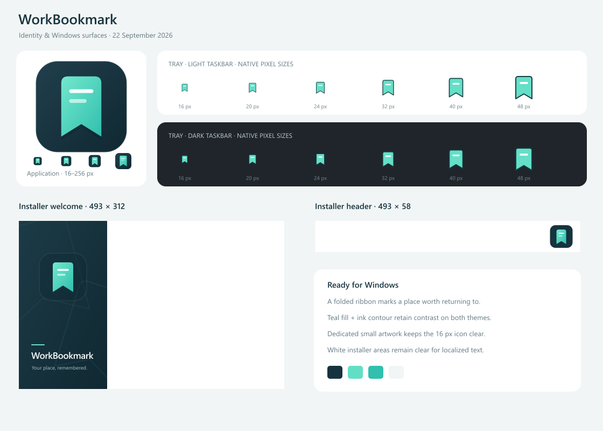

# 업무 책갈피 / WorkBookmark

Windows 탐색기·Excel·Word·PowerPoint·메모장의 작업 위치와 Edge·Chrome·네이버 Whale 웹페이지를 로컬에 남기는 트레이 도구입니다.

**0.2.8 정식 배포:** 기존 v0.2.8의 MSI·ZIP과 소스를 유지해 정식 릴리스 채널로 전환했습니다. 이미 0.2.8을 사용한다면 재설치할 필요가 없습니다. 사용자가 실제 Whale에서 저장·재열기가 정상 동작함을 확인했습니다(USER_CONFIRMED). Windows·Whale build와 원시 로그가 있는 통제 시험은 아니므로 모든 환경 검증으로 확대하지 않습니다. 기존 Release 빌드 경고·오류 0개와 브라우저 자동검사 34개·패키지 검사 54개를 재사용하며 전체 Office·스티커·설치 수명주기를 새로 검증한 것은 아닙니다. [정식 전환 기록](docs/stable-release-20261005.md) · [변경 사항](docs/release-notes-v0.2.8.md) · [기존 검증 근거](docs/evidence/whale-support-2026-09-27/README.md).

0.2.7의 **메모 한 줄·바로가기 화살표·편집 시 일시 확대**와 사용자 크기 보존은 유지합니다. 기존 결과는 [0.2.7 검증 기록](docs/evidence/sticker-single-row-2026-09-27/README.md)에서 확인하세요.

**[설치 및 사용 매뉴얼](docs/user-manual.ko.md)** — MSI·포터블 설치, 프로그램별 사용법, 설정, 백업·복원, 업데이트·제거와 문제 해결을 안내합니다. 처음 실행해 보려면 [빠른 시작](docs/quick-start.ko.md)을 참고하세요.

**[WorkBookmark 0.2.8 릴리스](https://github.com/prozac0401/BookMark/releases/tag/v0.2.8)** — MSI·포터블 ZIP·소스·검증 파일을 기존 형식으로 제공합니다. 패키징 한 차례의 검사 결과는 릴리스 첨부 검증 JSON, 소스 커밋은 SourceSnapshot.json, 파일 해시는 SHA256SUMS.txt에서 확인합니다. [MSI 설치 안내](docs/windows-installer.ko.md)의 이전 경로 이행 절차는 계속 적용됩니다.

**0.2.8은 0.2.4의 사용자 지정 설치 경로 보존 수정을 포함합니다.** 메모 자동 저장과 DB v5도 유지합니다.

메모가 있으면 **메모가 스티커 제목**이 됩니다. 메모가 없을 때만 URL·폴더 주소·파일명을 보여 줍니다. 제목을 클릭하거나 **Ctrl+E**로 편집하고, **다른 창이나 스티커로 이동하면 자동 저장**합니다. **Enter**로 바로 저장하거나 저장 전에 **취소 / Esc**로 되돌릴 수 있습니다. 저장 버튼은 표시하지 않습니다.

설치 패키지는 **서명되지 않았습니다**. 이번에는 브라우저 관련 검사와 빌드를 확인했습니다. 패키징은 소스 커밋 후 한 차례의 구조·파일 추출 검사 54개를 수행하고 릴리스 검증 JSON으로 제공합니다. 메타데이터 주입 검사는 실제 Whale 접근성·저장·재열기 검증을 대신하지 않습니다. Office·스티커·전체 통합 검사는 재실행하지 않았으며 이전 통과 수를 이번 결과에 합산하지 않았습니다.



Windows 빌드·자동검사와 실제 환경별 확인 결과는 [검증 보고서](docs/validation-report.md)와 [호환성표](docs/compatibility.md)에 정리했습니다.

- Ctrl+Alt+B: 탐색기 폴더/단일 선택 항목, Excel 셀, Word 본문 위치, PowerPoint 슬라이드 기록
- 메모장: 새 문서·미저장 내용에서 Ctrl+Alt+B로 본문과 선택 위치 자동 보관. 재개 시 저장 당시 내용의 별도 복원본을 엽니다.
- Edge·Chrome·네이버 Whale: 확장 없이 Ctrl+Alt+B로 현재 페이지의 제목·URL 저장. 주소 확인이 제한된 화면은 트레이의 ‘웹페이지 URL로 추가…’ 사용. 기존 Edge·Chrome용 [브라우저 확장](browser-extension/README.md)은 선택 사항이며, Whale 확장 연결 등록은 이번 범위에 포함하지 않습니다.
- Ctrl+Alt+J: 설정에서 선택한 목록 또는 스티커 표시. 목록은 Enter, 스티커는 오른쪽 화살표(바로가기)로 저장 위치 재개
- 포스트잇 스티커: 평상시 메모와 바로가기 화살표를 한 줄로 표시, 편집할 때 확대. 배경 여백으로 이동하고 테두리로 크기 조절, 다른 조작은 우클릭 메뉴
- 선택 메모, 검색, 삭제/10초 연속 되돌리기, 최근 삭제 복원, 접근 실패 항목의 경로 재지정
- 사용자별 로컬 SQLite, 요청마다 별도 STA worker, 외부 전송 없음

[후속 구현 진행·결정 기록](docs/implementation-progress.md) · [한국어 사용 안내](docs/quick-start.ko.md) · [P0 검증](docs/feasibility-report.md) · [구현 결정](docs/decisions.md)

## 실행

**0.2.3 이하를 사용자 지정 경로에 설치했다면 기존 MSI와 원래 INSTALLFOLDER를 지정해 먼저 제거한 뒤 새로 설치하세요.** 기본 경로 설치는 일반 업데이트를 확인했습니다. [설치 경로 이행 안내](docs/windows-installer.ko.md)를 먼저 확인하세요.

`WorkBookmark-0.2.8-win-x64.msi`를 실행하면 기본 경로의 이전 MSI 설치를 자동 제거하고 현재 사용자에게 새 버전을 설치합니다. 책갈피와 설정은 유지됩니다. 설치 완료 화면의 **업무 책갈피 실행**은 기본 선택되어 있으며, 바로 실행하지 않으려면 선택을 해제한 뒤 마칩니다. 시작 메뉴에서도 실행할 수 있습니다. Windows 로그인 시 자동 실행은 설정에서 끌 수 있습니다. 제어판 ‘프로그램 제거’ 또는 Windows ‘설치된 앱’에서 제거할 수 있으며 책갈피 데이터는 유지됩니다. 관리자 권한과 SDK 설치는 필요하지 않습니다.

포터블 사용은 self-contained win-x64 ZIP을 **폴더 전체**로 압축 해제하고 `WorkBookmark.exe`를 실행합니다. 트레이 메뉴에서 종료할 수 있습니다.

새 스티커의 기본 내용 영역은 100% 배율 기준 **260×36**, 최소 **240×36**입니다. 메모는 9.5pt 한 줄로 표시하고 오른쪽에 28×28 화살표 버튼을 둡니다. 제목줄·종류 아이콘·접기·지우기 버튼은 표시하지 않습니다. **배경 여백을 끌어 이동**하고 가장자리로 크기를 바꾸며, **우클릭 메뉴**에서 접기·지우기·숨기기 등을 사용합니다. **Esc**로 잠시 숨기고 **Ctrl+Alt+J**로 다시 표시합니다.

0.2.6에서 기본 내용 크기 260×88을 쓰던 스티커만 한 줄 기본 크기로 줄입니다. 화면 배율을 반영한 저장 크기를 기준으로 기존 기본 크기를 판별합니다. 사용자가 조절한 크기와 선택한 목록/스티커 모드는 유지합니다. 표시 규칙을 한 번도 적용하지 않은 이전 설정은 기존 최초 적용 정책에 따라 스티커 모드와 새 기본 크기를 사용합니다. 위치·모니터·접힘과 삭제된 항목의 배치도 보존합니다.

스티커 모드로 실행하면 단축키를 누르기 전부터 스티커가 다른 일반 창 위에 나타납니다. 고정·해제 버튼은 없으며, **제목을 한 번 클릭**하면 그 스티커 안에 입력칸이 열립니다. 메모가 없어 URL·주소·파일명이 보일 때도 같은 제목을 누르면 됩니다. **Ctrl+E**로도 편집을 시작할 수 있습니다. 편집할 때 폭은 유지합니다. 내용 높이가 160보다 작으면 170으로 잠시 늘리고, 이미 충분히 큰 창은 크기를 바꾸지 않습니다. **저장 성공·취소 후에는 편집 직전 크기·접힘 상태로 돌아갑니다.** 화면 안쪽으로 자동 보정한 위치는 복구하고, 직접 이동한 위치는 유지합니다. 다른 창으로 이동해 자동 저장해도 같습니다. 저장 버튼은 없습니다. **Enter**로 바로 저장하거나 저장 전에 **취소 / Esc**로 편집을 취소할 수 있습니다. 저장하지 못하면 입력한 글과 펼친 편집 영역이 남으므로 **Enter**를 누르거나 다른 창으로 다시 이동해 재시도하세요. 자세한 사용법은 [사용 매뉴얼](docs/user-manual.ko.md)을 참고하세요.

0.2.0은 데이터 형식을 v5로 갱신하고 변경 전 `.bak` 백업을 남깁니다. **0.1.7은 갱신된 DB를 읽을 수 없습니다.** 구버전 복귀에는 업그레이드 전 백업 복원이 필요합니다. [백업·업데이트 안내](docs/user-manual.ko.md#maintenance)를 확인하세요.

0.2.8도 DB v5를 사용하며, 0.2.0~0.2.7에서 업데이트할 때 새 스키마 이전은 없습니다. 설정에 표시 규칙 적용 버전을 기록하며, 0.2.5 이후 선택한 모드와 사용자 크기를 다시 초기화하지 않습니다.

## 소스에서 빌드

Windows x64와 .NET SDK **10.0.401**이 필요합니다. 브라우저 확장 자동시험에는 Node.js가 필요하며, PATH에 없으면 build.ps1의 -NodePath로 실행 파일을 지정합니다. 설치되어 있지 않으면 `scripts/bootstrap-sdk.ps1`이 저장소의 `.tools/dotnet`에 공식 ZIP을 내려받고 SHA-512 확인 후 압축 해제합니다. 시스템 SDK를 바꾸지 않습니다.

```powershell
.\scripts\bootstrap-sdk.ps1
.\scripts\build.ps1 -Package -Msi
```

직접 실행 시:

```powershell
$dotnet = ".\.tools\dotnet\dotnet.exe"
& $dotnet restore WorkBookmark.sln --locked-mode --configfile NuGet.Config
& $dotnet build WorkBookmark.sln -c Release --no-restore
& $dotnet run --project tests/WorkBookmark.Core.Tests -c Release --no-build
& $dotnet run --project tests/WorkBookmark.Integration.Tests -c Release --no-build
& $dotnet publish src/WorkBookmark.App -c Release -r win-x64 --self-contained true --no-restore -o artifacts/publish/win-x64
```

배포 MSI·ZIP·Source.zip·검증 JSON·SHA256SUMS.txt는 `artifacts/releases/<빌드시각>/`에 생성됩니다. MSI만 만들 때는 `scripts/build.ps1 -Msi`를 사용합니다. 기본 `Commit` 모드는 깨끗한 작업 트리의 Git HEAD로 Source.zip을 만듭니다. 아직 커밋하지 않은 수정까지 함께 배포하려면 `scripts/build.ps1 -Package -Msi -SourceMode WorkingTree`를 사용합니다. `SourceSnapshot.json`에 기준 커밋과 소스 모드를 기록합니다. 런타임/패키지는 lock 파일로 고정합니다. 자동시험은 Office 실기시험을 대신하지 않습니다.

## 구조

`Core`: DTO·경로 정책·IPC / `Storage`: SQLite / `Windows`: Shell·Office·실험 PDF / `App`: WinForms UI·수명 관리. `tools/Probes`와 `tools/WindowsChecks`는 합성 자료로 P0를 재현하는 개발용 도구이며 실행 ZIP에 포함하지 않습니다.

[확장 요구명세](docs/extension-requirements.md)와 [확장 검증 결과](docs/extension-validation.md)에 변경 범위와 근거를 기록했습니다. [GitHub 릴리스](https://github.com/prozac0401/BookMark/releases)에서 MSI·포터블 ZIP·소스·검증 파일과 이전 버전을 받을 수 있습니다.
